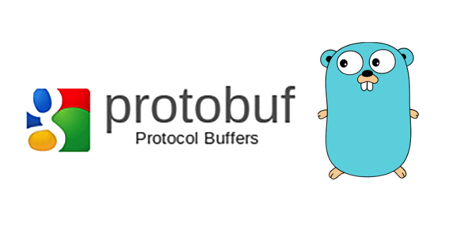
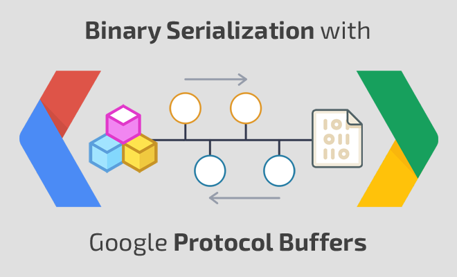

# Protocol Buffers 文档

Protocol Buffers 相关文档的内容。



## Protocol Buffers 简介
如果你在互联网上搜索的话，你可能会看到下面的说明文字。

Google Protocol Buffer( 简称 Protobuf) 是 Google 公司内部的混合语言数据标准，目前已经正在使用的有超过 48,162 种报文格式定义和超过 12,183 个 .proto 文件。

他们用于 RPC 系统和持续数据存储系统。

Protocol Buffers 是一种轻便高效的结构化数据存储格式，可以用于结构化数据串行化，或者说序列化。

它很适合做数据存储或 RPC 数据交换格式。可用于通讯协议、数据存储等领域的语言无关、平台无关、可扩展的序列化结构数据格式。

目前提供了 C++、Java、Python 三种语言的 API。
 

我们是在实际的数据处理的时候，需要使用 JSON 来序列化数据，但是又考虑到 JSON 在传输的时候数据过大，同时还有很多并不需要的垃圾文件。
我们才考虑到了 Protocol Buffer 提供的功能。




# Protocol Buffers 开发者指南

欢迎来到 protocol buffers 的开发者指南。protocol buffers 是一个语言中立，平台中立针对通讯协议，数据存储和其他领域中对结构化数据进行序列化的扩展方法。

本文档主要针对的是 Java，C++ 或 Python 的开发人员希望在开发的应用程序中使用 Protocol Buffers。这个有关 Protocol Buffers 摘要性的介绍将会告诉你如何开始使用 Protocol Buffers。
如果你希望更加深入的了解有关 Protocol Buffers 的内容，你可以进入 tutorials 或者 protocol buffer encoding 页面来详细了解。

有关 API 的参考文档，请参考页面：reference documentation 这里提供了所有这 3 种语言的参考，同时也针对 .proto language 和 style 提供相关的指南。

## 什么是 Protocol Buffers
Protocol buffers 是对结构化数据序列化的一个灵活，高效，自动化工具 —— 你可以将 Protocol buffers 想象成 XML，但是体积更小，更快也更加简单。

你可以自己定义你的结构化数据，然后你可以使用特定的代码生成工具来非常容易对你的结构化数据进行读取和写入。这些数据的读取和写入可以是一系列的数据流和使用不同的计算机程序语言。
你甚至可以在不对已经部署的程序进行破坏的情况下更新你的数据结构。

## Protocol Buffers 是如何进行工作的
你需要制定你希望如何将你的数据进行序列化。你是通过 proto 文件来定义你的消息结构化数据的。

每一 protocol buffer message 是一个小的信息记录逻辑，这个消息中包含有一系列的名字，变量对照序列。

下面是一些基本的.proto 文件，这些文件中定义了一个消息，这个消息包含有一个 person 信息：

```
message Person {
  required string name = 1;
  required int32 id = 2;
  optional string email = 3;

  enum PhoneType {
    MOBILE = 0;
    HOME = 1;
    WORK = 2;
  }

  message PhoneNumber {
    required string number = 1;
    optional PhoneType type = 2 [default = HOME];
  }

  repeated PhoneNumber phone = 4;
}
```

通过上面你可以看到这个消息的格式非常简单—— 每一个消息类型都有一个或者多个唯一进行编号的字段，每一个字段包含有一个名字和变量类型。

变量可以为数字（整形或者浮点型）（numbers），布尔类型（booleans），字符串（strings），原生二进制（raw bytes）甚至其他的 protocol buffer 消息类型，能够允许你分级的结构化你的数据。

你可以将字段指定为可选字段（optional fields），必须字段（required fields）和重复字段（repeated fields）。你可以从下面的 Protocol Buffer Language Guide 页面中找到更多有关 .proto 的定义。

一旦你成功定义了你的消息，你可以针对你使用的语言使用你定义的 .proto 来运行 protocol buffer 编译器（protocol buffer compiler）来生成数据访问类。

针对每一个字段，在数据访问类中提供了简单的访问方法（例如 name() 和 set_name()）和序列化到原生 2 进制数据和从原生 2 进制数据反序列化的方法。

针对上面的定义，如果你现在使用的是  C++ 语言的话，当你把消息定义进行编译后，你将会得到一个称为 Person 的类。对数据进行序列化和从序列化的数据中（protocol buffer 消息）重新获得 Person 数据。

然后你可以写一些类似 Person person; 的代码。

```cpp
Person person;
person.set_name("John Doe");
person.set_id(1234);
person.set_email("jdoe@example.com");
fstream output("myfile", ios::out | ios::binary);
person.SerializeToOstream(&output);
```

随后，你可以对消息进行读取：

```cpp
fstream input("myfile", ios::in | ios::binary);
Person person;
person.ParseFromIstream(&input);
cout << "Name: " << person.name() << endl;
cout << "E-mail: " << person.email() << endl;
```

你可以向你的消息中添加新的字段而不会损坏老的消息。这是因为在老的消息处理中，针对新的字段是完全忽略掉的。因此，如果你在你的通讯协议中使用 protocol buffers 为数据结构的话，
你可以对你的协议和消息进行扩展而不需要担心老的代码没有办法编译通过，或者损坏老的代码。

你可以访问 API Reference section 页面中的内容来了解完整 protocol buffer 代码的生成和使用。

你也可以在 Protocol Buffer Encoding 页面中了解更多protocol buffer 消息是如何进行编码的。

## 为什么不使用 XML
针对 XML 来说 Protocol Buffers 具有更多的优势来对序列化结构数据。

* 更加简单
* 小于 XML  3 到 10 倍
* 快于 XML 20 到 100 倍
* 松耦合
* 使用程序工具来创建数据访问类，使数访问类更加简单
* 假设，你需要讲 person 这个数据进行定义，在 XML 你需要使用：

```xml
<person>
  <name>John Doe</name>
  <email>jdoe@example.com</email>
</person>
```
来进行定义。

在 Protocol Buffers 中针对上面的消息文本化（text format）后显示为：

```
# Textual representation of a protocol buffer.
# This is *not* the binary format used on the wire.
person {
  name: "John Doe"
  email: "jdoe@example.com"
}
```

当上面的消息被编码为 Protocol Buffer 二进制格式（binary format）上面的文字可能小于 28 bytes，并且可能需要 100-200 纳秒（nanoseconds）来进行处理。

我们将上面转换为可以人为读取的目的主要是为进行调试和编辑。

如果你使用 XML 的话，上面的信息至少需要 69 bytes （你需要删除所有的空格），同时你需要 5,000-10,000 纳秒（nanoseconds）来进行处理。

同时，对 protocol buffer 进行操作也是非常容易的：

```cpp
cout << "Name: " << person.name() << endl;
cout << "E-mail: " << person.email() << endl;
```

如果使用的是 XML 的话，你需要进行下面的操作：

```cpp
cout << "Name: "
     << person.getElementsByTagName("name")->item(0)->innerText()
     << endl;
cout << "E-mail: "
     << person.getElementsByTagName("email")->item(0)->innerText()
     << endl;
```

但是，protocol buffers 并不是任何时候都会比 XML 好。例如，针对基于文本的标记语言（例如，XML），protocol buffers 就不是一个很好的选项，
因为你不能使用 protocol buffer 更好的在文档中进行交换。更主要的是 HTML 是人类可以阅读和编辑的。protocol buffer 也不是不可以人为的读取，但是针对原生的 protocol buffer 格式是没有办法人为进行读取和编辑的。

XML 与  HTML 一样，在某种程度上是一种自我描述数据。protocol buffer 只针对你在 .proto 文件中描述的内容进行表达。

## 看起来像一个解决方案，我应该如何开始呢
Download the package – 这包中含有针对 Java, Python, 和 C++ protocol buffer 编译器源代码，和你需要进行 I/O 和测试的类。希望对你的编译器进行编译和构建，请参考代码中的 README 文件。

一旦你完成了所有的设置，请参考 tutorial 页面中的内容来选择你需要的语言——这个能够帮助你使用 protocol buffer 创建一个简单的应用程序。

## 介绍 proto3
在我们最新的 version 3 发行版 中推出了新的语言版本 —— Protocol Buffers language version 3（另称 proto3），在这个版本中针对我们已经存在的语言版本（proto2）使用了一些新的特性。

Proto3 简化了 protocol buffer 语言，使其更加容易使用并且能够支持更多的语言：我们当前发行的 proto3 能够让你创建 Java, C++, Python, Java Lite, Ruby, JavaScript, Objective-C, and C#。

另外你也可以通过使用 Go protoc 插件来用 proto3 创建 Go 代码，这个插件你可以到 golang/protobuf Github 中下载到。更多的语言还在逐步进行支持中。

请注意，这 2 个版本的 API 并不是完全兼容的。为了照顾还在使用老版本的用户，我们将会在新的 protocol buffers 发行中同时支持老的版本。

你可以在下面的发行日志（release notes）查看 2 个版本的主要不同。有关 proto3 的句法，请参考 Proto3 Language Guide 中的内容，针对 proto3 的完整文档还没有编写完成，将会随后推出。

看起来 proto2 和 proto3 可能会产生一些混淆，这是因为原始的开源  protocol buffers 实际上是 Google 内部语言的第二个版本，同时我们的开源版本也是从 v2.0.0 开始的。

简单来说就是 proto 最开始的版本是 Google 内部使用的，在 proto 第二个版本的时候，Google 决定进行开源了，所以开源的 proto 是从 proto2 开始的。

## 一个简短的历史
Protocol buffers 最开始是在 Google 内部进行开发的，用于处理在索引服务器上请求/响应（request/response）的协议。

在 Protocol buffers 之前，针对请求和响应，使用的是 marshalling/unmarshalling，这个能够支持一系列的协议。但是结果看起来却是非常的难看，例如：

```
if (version == 3) {
  ...
} else if (version > 4) {
  if (version == 5) {
    ...
  }
  ...
}
```


明确格式化的的协议也使新版本的协议更加难以推出，这是因为开发者必须能够了解老协议在服务器之间是如何进行处理的，同时也需要了解新的协议。只有对新老协议都有所了解后才能逐步使用新的协议替换老的协议。

Protocol buffers 被用来设计解决上面的很多问题：

* 新的字段比较能够容易的进行定义，中级服务器不需要对数据进行检查，直接对数据进行处理，同时也可以直接传输数据而不需要了解数据是如何进行定义的。
* 格式使用自描述，能够更加容易支持更多的语言（C++，Java 等）。

但是，用户还是需要手动书写他们自己的处理diam。

作为系统的进化来说，它获得了许多其他的特性和用途：

* 自动生成序列化和反序列化代码而避免手动书写这些代码。
* 除了开始使用短期RPC（远程过程调用）请求，人们开始使用 protocol buffers 作为高效的自描述结构化数据格式（主要针对数据短期存在，例如在 Bigtable）。
* 服务器RPC接口开始被声明为协议文件的一部分，协议编译器生成根类，用户可以通过服务器接口的实现和重载它们。

Protocol buffers 在 Google 中成为针对数据的通用语言—— 随着时间的流逝，在 Google 内部已经有超过 348,952 .proto 文件被定义。这些被用在 RPC 系统和存储系统中存储数据。

[Annotation（注解）](installation.md ':include')